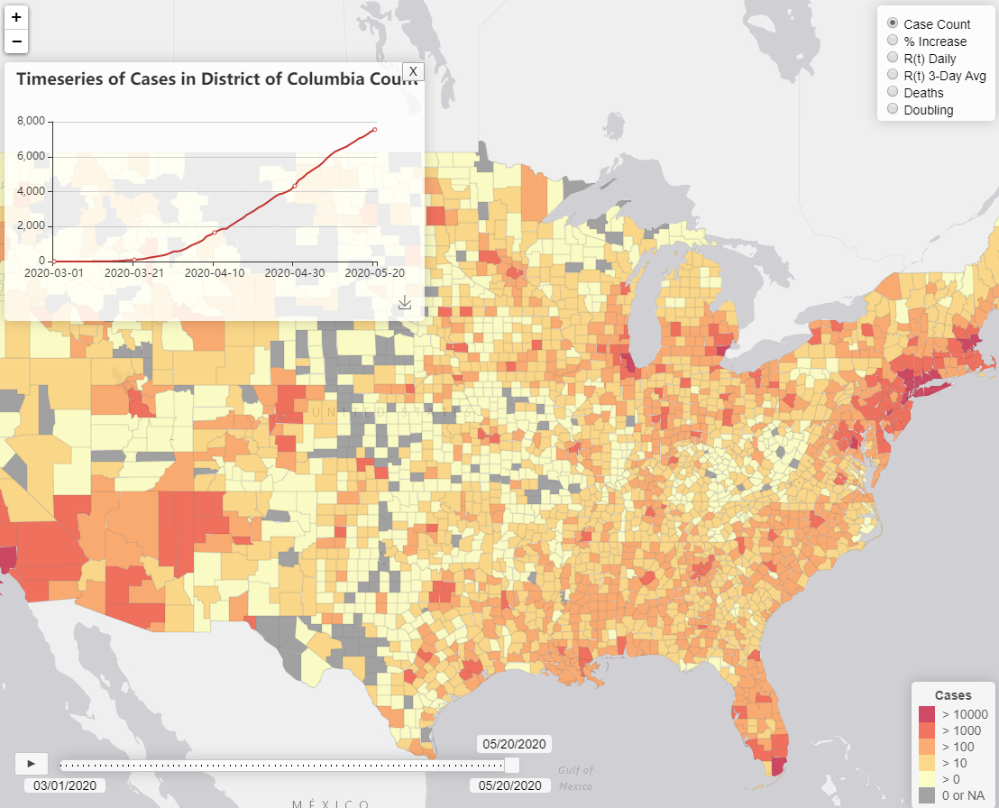

# bigmap

## Description

Bigmap is an exploratory data analysis tool that provides a map interface for viewing information about COVID19 in the United States.

Bigmap provides a timeline view that allows users to see the progression of confirmed COVID19 infections by county from March 1, 2020 to present.

## Installation

Download or git clone the project to a local system.  Move the entire project to a directory that is served up by a web server, such as [nginx](http://nginx.org/en/docs/windows.html).

Open up your web browser and point it at [bigmap](http://localhost/bigmap/).

## Contributions

Additions to the repository are welcome.  Please clone the project in GitHub and then provide a pull request.

## Credits

Bigmap was developed by Ian Kloo from the United States Military Academy.

## License

Bigmap is released under an [MIT License](https://opensource.org/licenses/MIT).